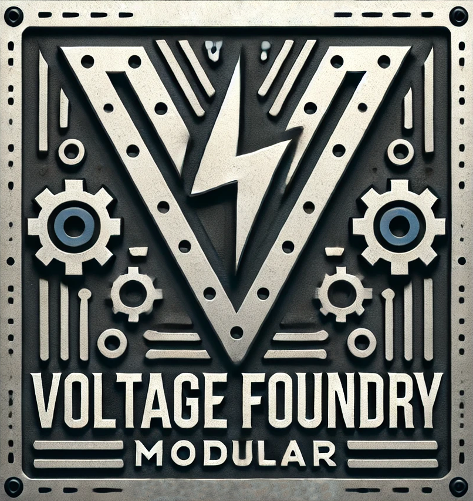

# Voltage Foundry Modular

Voltage Foundry Modular is a Eurorack modular synthesizer module manufacturer based in Brazil. We are dedicated to providing high-quality, innovative, and affordable modules to the modular synthesizer community.

Some of the modules are inspired by open-source creations, and we are committed to contributing to the community by sharing our designs and code.

The concept for some modules is to have hardware platforms which can be used by different modules based on firmware. This way, we can provide a variety of modules with different functionalities using the same hardware platform.

## Platforms

- **[Forge V1]**: A [platform](https://github.com/VoltageFoundryMod/ForgeSeries) for modules with a display, encoder, and buttons. The firmware is based on the Arduino platform and Seeed Xiao board. The hardware contains 2 DAC outputs, 2 digital outputs and 3 inputs.

## Modules

- [ClockForge](https://github.com/VoltageFoundryMod/ForgeSeries/tree/main/firmware-CLK): 6HP Clock Generator with multiple features like tap tempo, clock division, Euclidean rhythm and more. Part of the **Forge** Series.
- [NoteForge](https://github.com/VoltageFoundryMod/ForgeSeries/tree/main/firmware-DQ) - A Dual Quantizer with selectable scales and root notes for each channel, octave shift and envelopes. Part of the **Forge** Series.
- [ForgeView](https://github.com/VoltageFoundryMod/ForgeSeries/tree/main/firmware-SCP) - A scope visualizer with dual-trace, trigger view and more. Part of the **Forge** Series.
- [IRONMix]() - A 4HP 2 channel stereo line-in mixer with volume control and a headphone output section.

## License

The hardware and firmware designs are released under the MIT License. Please check each repository LICENSE file for more information.
